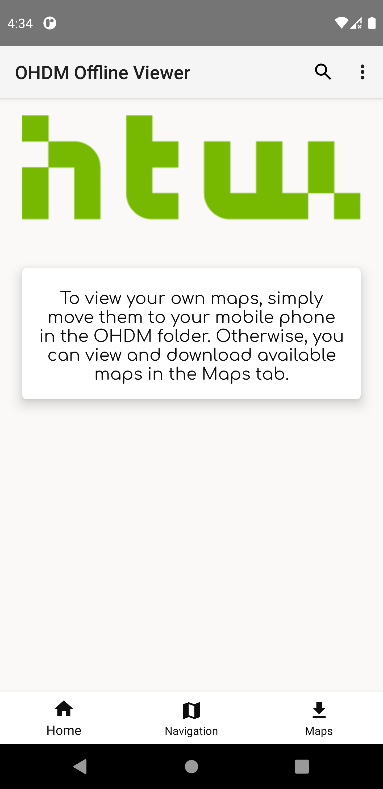
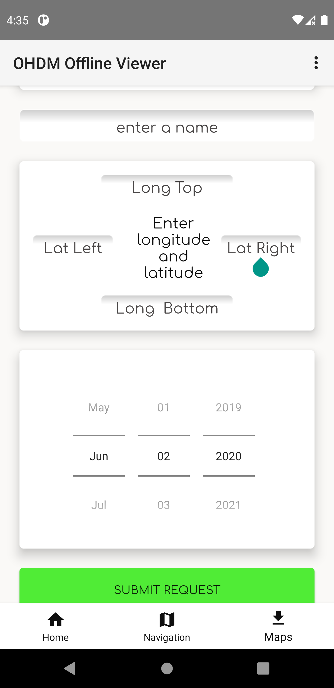

# OHDM Offline Viewer

## Goal of this project
The goal of this repository is to render data from Open Historical Data Map. OHDM has its own data base structure but can provide data for a defined spatial temporal context - in other words: a data (a day) and a region (polygon). Those data can be produced in the OSM XML format which is well known from Open Street Maps. This viewer is an offline viewer. Map data are stored and rendered on the phone which makes apps independent from actual network connections.

To avoid caching dozens of different zoom layers, vector tiles are being used. This makes the navigation and zoom interaction fast.

## Getting Started
*Follow these instructions to build and run the OHDM Offline Viewer*
1. ```git clone https://github.com/OpenHistoricalDataMap/OfflineViewer.git```
2. [Install Android Studio](https://developer.android.com/sdk/index.html).
3. [Downlaod Open Historical Data maps](http://www.ohdm.net/)
4. Import the project. Open Android Studio, click `Open an existing Android
   Studio project` and select the project. Gradle will build the project.
4. Connect your Android Device with your Computer.
5. Run the app. Click `Run > Run 'app'`. After the project builds you'll be
   prompted to build or launch an emulator. You then can choose your mobile phone. 
6. Open ```View > Tool Windows > Device File Explorer``` and place your maps in your mobile phone device storage. There should be a ```OHDM``` (In the android emulator, you may have to create it: `Device Explorerer > sdcard > New`) directory in the internal storage. 

## Convert ```.osm``` to ```.map```-files
Read the documentation of the [OHDMWebSevice](https://github.com/OpenHistoricalDataMap/DowloadWebService/wiki/osm2map) 
for more information.

## Use custom map-file download center
This application has an integrated download functionality for map files. 
This makes it possible to host various map files on a remote server. 
You then can easily download them using the app. 

**WARNING:** At this point of development, the download center is a simple FTP server that does not meet any security requirements.
Using it in productivity, will make your server extremely vulnerable.

## Showcase

Home                                               |  Request
:-----------------------------------:|:---------------------------------------:
        | 

DownloadCenter AllMaps               |  DownloadCenter Cateories
:-----------------------------------:|:---------------------------------------:
   | 

Settings                             |  About
:-----------------------------------:|:---------------------------------------:
    | 


## Contact
Developed by: [FalcoSuessgott](https://github.com/FalcoSuessgott)
Developed by: [WilliBoelke](https://github.com/WilliBoelke)
Developed by: [NoteFox](https://github.com/NoteFox)

Project Link: [Open Historical Data Map](https://github.com/OpenHistoricalDataMap)

Institution: [HTW Berlin](https://www.htw-berlin.de/)

Mail: [info@ohdm.net](info@ohdm.net)
 
